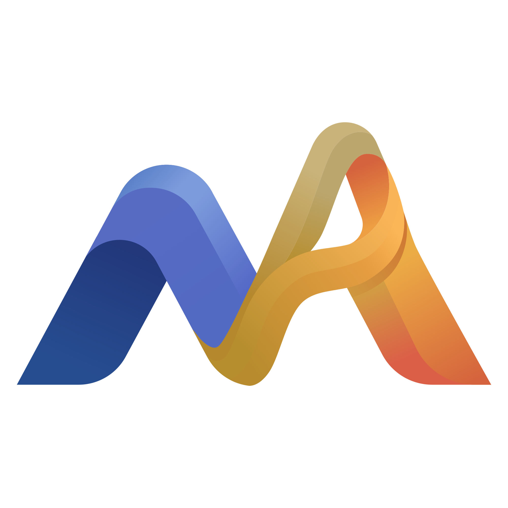

<p align="center">
  
</p>

<h1 align="center">Markan</h1>

<p align="center">
  A cross-platform desktop PDF annotation and editing app built with Electron, React, and TypeScript.
</p>

<p align="center">
  
  
  
  
</p>

## Overview

Markan is a desktop PDF workspace for reading, annotating, and exporting PDFs. It focuses on a fast viewer experience with editable overlay objects, then flattens those edits into a standard PDF when saving or exporting.

The app is built as an Electron desktop application, so the product direction is cross-platform. Current packaging scripts include macOS packaging, and the core application stack is not tied to a web-only deployment model.

## Features

- Open and render PDF documents with PDF.js
- Page thumbnails, page navigation, zoom controls, and fit modes
- Editable overlay objects stored separately from the PDF canvas
- Rich text boxes with formatting controls
- PDF text-selection based highlighting
- Ink drawing, shapes, images, and math overlays
- Object selection, move, resize, duplicate, delete, and layer ordering
- Undo and redo for overlay editing
- Save and save-as flows with PDF flattening
- App-managed metadata for restoring editable overlays
- Settings dialog with app version and Korean/English language selection
- Dark workspace UI with shadcn-style local UI primitives

## Tech Stack

| Area | Technology |
| --- | --- |
| Desktop runtime | Electron, electron-vite |
| UI | React, TypeScript |
| Styling | Tailwind CSS, custom CSS tokens |
| PDF rendering | PDF.js |
| PDF writing/export | pdf-lib |
| Rich text | TipTap |
| UI primitives | Radix UI, local shadcn-style components |
| Icons | lucide-react |
| Tests | Vitest |
| Build | Vite, TypeScript |

## Getting Started

### Prerequisites

- Node.js 20 or newer
- npm

### Install

```bash
npm install
```

### Run the App

```bash
npm run dev
```

### Build

```bash
npm run build
```

### Package for macOS

```bash
npm run build:mac
```

## Scripts

| Command | Description |
| --- | --- |
| `npm run dev` | Start the Electron development app |
| `npm run build` | Type-check and build the Electron app |
| `npm run build:mac` | Build and package the macOS app |
| `npm run preview` | Preview the built Electron app |
| `npm run lint` | Run ESLint |
| `npm test` | Run Vitest test suite |

## Project Structure

```text
electron/
  main.ts             Electron main process, menu, dialogs, IPC, save handling
  preload.ts          Safe renderer bridge
  ipcChannels.ts      Shared IPC channel and command types

src/
  annotations/        PDF text-selection and highlight helpers
  components/         Shared layout and UI primitives
  coordinates/        PDF/viewport coordinate conversion
  i18n/               Language metadata and translation helpers
  math/               Math input, rendering, and flattening
  overlay/            Overlay object model, layer rendering, selection, history
  save/               Metadata, base PDF storage, flattening, export services
  settings/           Settings dialog
  text/               Rich text editing and flattening helpers
  tools/              Tool state and keyboard command resolution
  viewer/             PDF viewer, pages, thumbnails, zoom, navigation

public/
  logo/               Markan logo and app icon assets
  fonts/              Bundled Pretendard font assets
```

## Design Principles

- Keep PDF rendering and editable overlays separate while editing.
- Store persistent overlay positions in PDF page coordinates.
- Treat zoom and scroll as view state only.
- Flatten overlays only during save or export.
- Keep file I/O in the Electron main process behind a safe preload bridge.
- Prefer reusable local components before adding new UI dependencies.

## Language

The application currently supports Korean and English language settings. The settings dialog can be opened from the app menu or with `Cmd/Ctrl + ,`.

## License

No license has been specified yet.
